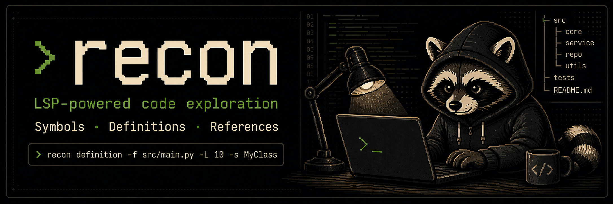

<p align="center">
  
</p>

# Recon — LSP-Powered Code Reconnaissance

[](https://badge.fury.io/py/recon-lsp)
[](https://pypi.org/project/recon-lsp/)

**Context Engineering for your Codebase.** Semantic code intelligence CLI for AI agents and developers.

Recon turns Language Server Protocol superpowers into simple terminal commands. No IDE required. 

---

## Why Recon? (LSP vs Grep)

When autonomous AI agents navigate large codebases, reading whole files doesn't make sense. The standard fallback is `grep` or `ripgrep`. While great for text matching, text search can be incredibly noisy—analyzing many fragments without context wastes tokens, increases tool calls, and risks missing the right context.

**Enter LSP (Language Server Protocol)**
LSP builds a structural (AST) understanding of your code, powering the Intellisense in your IDE. Recon exposes all of these capabilities directly to the terminal, including:
- **Go to Definition**
- **Find References**
- **Document Symbols (Classes, Functions, Variables)**
- **Workspace Symbol Search**
- **Hover (Types, Signatures, Docstrings)**
- **Context-Aware Completions**

Recon equips AI agents with **semantic code search**. Recent benchmarks comparing **LSP vs. grep** show clear advantages for AI coding agents:

- **Exact Precision & Completeness**: Eliminate the 90%+ noise typical of text search. LSP understands scope and finds exact references that `grep` misses.
- **2–34× Less Token Usage**: Structured, symbol-aware data drastically reduces context window bloat compared to raw file chunks.
- **33% Faster & Cheaper**: Agents resolve definitions in a single tool call, cutting LLM execution time and inference costs.
- **Agent-Agnostic**: Recon is the CLI bridge. It equips ANY coding agent framework with LSP superpowers, entirely independent of an IDE.

---

## Documentation
Detailed documentation is available in the [docs](docs/) directory:
- [Introduction & Philosophy](docs/index.md)
- [Installation](docs/installation.md)
- [Usage Guide](docs/usage.md)
- [Agent Integration](docs/agent_integration.md)

---

## Installation

Recon is officially published on PyPI.

### Option 1: Install globally via `uv` or `pipx` (Recommended)
This makes `recon` accessible from anywhere in your terminal:
```bash
uv tool install recon-lsp
# or
pipx install recon-lsp
```

### Option 2: Install into active environment / venv
```bash
pip install recon-lsp
# or with uv:
uv pip install recon-lsp
```

---

## Quick Start

```bash
# 1. Interactive setup (creates .recon.toml in current repo)
recon init

# Or manually configure your workspace:
recon config --lang python --repo-path /path/to/your/repo

# 2. Check language server diagnostics & auto-install if needed:
recon setup                        # Diagnostic status overview of all 12 languages
recon setup python                 # Diagnose & verify Python LSP
recon setup php --install          # Automatically install / download LSP

# 3. Start querying your codebase:
recon symbols -f src/main.py --human
recon definition -f src/main.py -L 10 -s MyClass --context 3 --human
recon references -f src/main.py -L 10 -s MyClass --human
recon hover -f src/main.py -L 10 -s MyClass
```

---

## Commands Reference

### LSP Queries

| Command | Description |
|---|---|
| `recon definition -f <file> -L <line> -s <sym>` | Jump to symbol definition |
| `recon references -f <file> -L <line> -s <sym>` | Find all references across codebase |
| `recon hover -f <file> -L <line> -s <sym>` | Extract docstrings, type signatures, hover details |
| `recon symbols -f <file>` | List all classes, functions, variables in a file |
| `recon workspace-symbols -q <query>` | Search symbols across the entire workspace |
| `recon completions -f <file> -L <line> -s <sym>` | Get context-aware autocompletions |
| `recon batch <file.json>` | Run multiple LSP queries from a JSON file in one go |

### Setup & Configuration

| Command | Description |
|---|---|
| `recon init` | Interactive setup wizard (TUI with language picker & auto-verification) |
| `recon setup` | Real-time diagnostic table for all 12 supported languages |
| `recon setup <lang> -i` | Automatically install / download the language server |
| `recon config --lang <l>` | View or set configuration defaults |
| `recon info` | Show project info, daemon status, and config paths |

### Daemon Management & AI

| Command | Description |
|---|---|
| `recon daemon start/stop/status/restart` | Manage the background LSP daemon |
| `recon agent-skill` | Print the recon-skills reconnaissance workflow for AI agents |

*For full details and examples, view the [Usage Guide](docs/usage.md).*

---

## Output Formats

```bash
# JSON (default, ideal for AI agents and automated scripts)
recon symbols -f main.py

# Human-readable (compact file:line format with syntax-highlighted snippets)
recon symbols -f main.py --human

# Rich table (styled terminal table view)
recon symbols -f main.py --table
```

---

## Core Flags

| Flag | Short | Description |
|---|---|---|
| `--file-path` | `-f` | Relative path to the file |
| `--line` | `-L` | Line number (0-indexed) |
| `--symbol` | `-s` | Symbol name (auto-calculates column) |
| `--column` | `-c` | Column number (alternative to `--symbol`) |
| `--context <N>` | | Number of surrounding lines to fetch for matched locations |
| `--human` | `-H` | Human-readable formatted output |
| `--table` | `-T` | Rich table terminal output |

---

## Supported Languages & Tools

| Language | Language Server | Setup Support |
|---|---|---|
| **Python** | jedi-language-server | `pip install jedi-language-server` |
| **Rust** | rust-analyzer | Auto-download / `rustup component add rust-analyzer` |
| **Java** | Eclipse JDT.LS | Auto-download (Requires Java 17+) |
| **TypeScript / JS** | typescript-language-server | Auto-install via npm / multilspy |
| **Go** | gopls | `go install golang.org/x/tools/gopls@latest` |
| **Ruby** | solargraph | `gem install solargraph` |
| **C#** | OmniSharp | Auto-download (Requires .NET 6+) |
| **C / C++** | clangd | System package manager (`apt install clangd`, `brew install llvm`) |
| **Dart** | dart language-server | Built into Dart SDK / `dart pub global activate` |
| **PHP** | intelephense | Auto-install via npm |
| **Elixir** | elixir-ls | Auto-download (Requires Elixir 1.13+, Erlang 24+) |
| **Kotlin** | kotlin-language-server | Auto-download (Requires Java 11+) |

Run `recon setup` to see real-time toolchain and installation diagnostics for all languages on your system.
